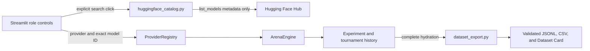

# Architecture

Password Arena uses three cooperating roles:

1. **Defender** creates a synthetic password according to the current difficulty and remembers which password families were breached.
2. **Attacker** ranks bounded guessing strategies, receives the previous round outcome, and adjusts future strategy weights.
3. **Evaluator** measures estimated entropy, structural weaknesses, guesses, runtime, and outcome.
4. **Reporter** converts structured runtime events into a two-sided defender/attacker journal and evaluator summary.

`ArenaEngine` coordinates the loop and returns serializable experiment results. `reporting.py` exports the same structured record as a password-safe Markdown experiment journal. The first release is deterministic and rule-based so the project is inexpensive, testable, and reproducible. Future model providers should implement the same role boundaries rather than receiving unrestricted tool access.

## Discovery and public-export boundaries

Hugging Face catalog discovery, model execution, and public dataset export are
separate paths:

`huggingface_catalog.py` never imports Streamlit, changes `ProviderRegistry`,
downloads weights, invokes inference, or uploads data. The UI constructs the catalog
only in the **Search Hugging Face** button branch. A selected result populates the
existing manual model field, while the chosen execution provider remains unchanged.

`dataset_export.py` is a pure public-boundary module rather than an extension of
ordinary reporting. This creates some duplicated version plumbing and a separate
schema to maintain, but it keeps the scalar allowlist, source-secret checks, and
fail-closed validation independently testable. Streamlit supplies fully hydrated
records and renders download controls; it does not construct dataset rows.

## Learning terminology

The MVP performs **adaptation through persisted state**, not model-weight training. A later reinforcement-learning mode may update a trainable policy, but it should be labeled separately so project claims remain accurate.

## Tournament module layout

Tournament Mode follows the same role boundaries, split so core statistics never
depend on Streamlit:

- `models.py` -- tournament data models (`MatchupConfig`, `MatchupSummary`,
  `MatchupResult`, `TournamentConfig`, `RoleUsage`, `ExclusionRecord`,
  `EfficiencyMetrics`, `ReplayMetadata`), plus `MatchupLike`: a structural
  `Protocol` satisfied by both `MatchupResult` (fresh) and
  `tournament_history.StoredMatchup` (reloaded), used everywhere a matchup is
  rendered or reported so those two types stay interchangeable. Deliberately
  lives here rather than in `tournament_view_models.py` so `reporting.py` can
  use it without pulling in `tournament_view_models.py`'s pandas dependency
  (only in the optional `dashboard` extra).
- `tournament.py` -- orchestration (`run_matchup`, `build_tournament_matrix`) and
  aggregation (`aggregate_matchup`, `compute_efficiency`, `calculate_confidence_interval`,
  `replay_matchup`). Each trial is executed through the same `build_arena_engine`
  path used by single-experiment runs -- no duplicated engine logic.
- `tournament_comparison.py` -- pure configuration comparison
  (`compare_tournament_configs`) plus saved-tournament comparison
  (`compare_stored_tournaments`). The latter composes the former with sets of
  persisted per-matchup replay versions; missing or mixed versions are explicit
  comparability concerns, never silently collapsed to one matchup. No Streamlit
  dependency.
- `tournament_history.py` -- persistence (`TournamentHistoryManager`: save/list/
  load/delete), schema versioning, and linking back to full experiments stored in
  `history.py`'s `HistoryManager`.
- `reporting.py` -- serialization, including the tournament-level JSON/Markdown/CSV
  exports, alongside the existing single-experiment exports.
- `dataset_export.py` -- pure round-level public benchmark construction, fixed
  scalar schema, JSONL/CSV serialization, Dataset Card generation, and final
  fail-closed safety validation. It never calls `ExperimentResult.to_dict()`.
- `huggingface_catalog.py` -- optional, metadata-only Hub discovery through
  `HfApi.list_models`. Dependency loading, token access, and network I/O occur only
  during an explicit search call; catalog results have no execution authority.
- `preflight.py` -- provider availability checking, split into a pure fingerprint
  function (safe to call every Streamlit rerun) and the actual network-calling
  checks (only ever invoked from an explicit UI action). No Streamlit dependency.
- `tournament_view_models.py` -- pure aggregation and transformation for the
  dashboard (overview totals, weighted leaderboards, heatmap rows, efficiency
  rows, thinking-level comparisons, result filtering). No Streamlit dependency;
  fully covered by strict mypy. `tournament_views.py` (below) must not recreate
  or weaken any calculation defined here.
- `tournament_dashboard.py` / `tournament_views.py` / `ui_helpers.py` -- Streamlit
  presentation only. They source every number they display from
  `tournament.py`/`tournament_history.py`/`reporting.py`/`tournament_view_models.py`/
  `preflight.py`/`tournament_comparison.py`/`dataset_export.py` and compute no
  statistics themselves. Saved public export is disabled unless every experiment
  ID linked by every stored matchup hydrates successfully.
